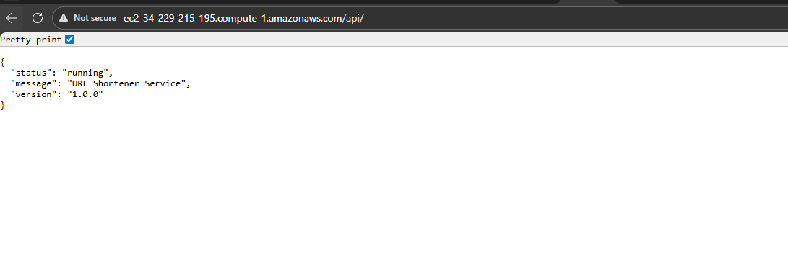
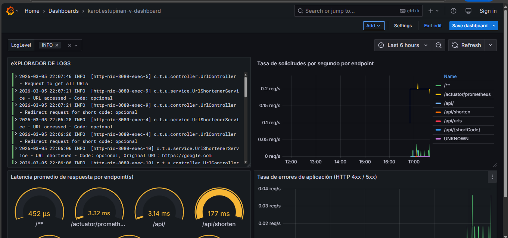
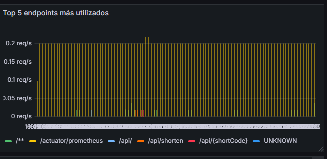
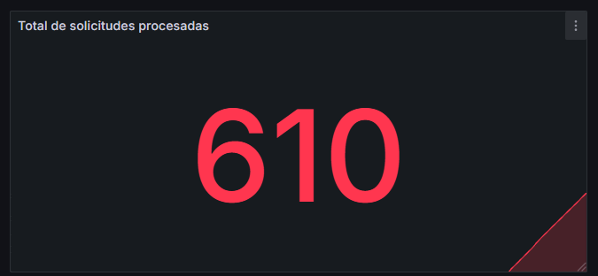

# Bitácora Experimento - Observabilidad y Monitoreo

**Karol Estupiñan** _____________________________  
---

Cuando acabes no olvides ayudarnos evaluando tu ⭐[experiencia](https://forms.office.com/r/US1LARPmec)⭐

## Tabla de Contenidos
- [Etapa 1: Preparación del Ambiente](#etapa-1-preparación-del-ambiente)
- [Etapa 2: Métricas Iniciales](#etapa-2-métricas-iniciales)
- [Etapa 2.1: Dashboard Base en Grafana](#etapa-21-dashboard-base-en-grafana)
- [Etapa 2.2: Propuesta de Métrica Personalizada](#etapa-22-propuesta-de-métrica-personalizada)
- [Etapa 3: Experimentación y Análisis del Sistema](#etapa-3-experimentación-y-análisis-del-sistema)

---

## Etapa 1: Preparación del Ambiente

### 1.1. Información de la instancia EC2

### 1.2. Verificación del despliegue

**¿La aplicación se desplegó correctamente?** 

- [X] Sí
- [ ] No

**Captura de pantalla de la aplicación funcionando:**

DNS: http://ec2-34-229-215-195.compute-1.amazonaws.com/
> _[Inserta aquí la imagen de la aplicación corriendo en /api/]_

### 1.3. Observaciones y problemas encontrados (opcional)
```


```

---

## Etapa 2: Métricas Iniciales

### 2.0.1. Generación de tráfico

**Endpoints probados:**

- [X] `GET /api/`
- [X] `POST /api/shorten`
- [X] `GET /api/{shortCode}`
- [X] `GET /api/urls`


### 2.0.2. Análisis de dos métricas relevantes

####  http_server_requests_active_seconds_max

**Gauge:**  
```

```

**Tipo de métrica:** 
- [ ] Counter
- [X] Gauge 
- [ ] Histogram 
- [ ] Summary

**Descripción de qué información aporta:**
```
El tiempo maximo en la que la peticion duro en un periodo de tiempo


```

**Relación con otras métricas (si aplica):**
```
Se relaciona con:
    http_server_request_seconds_count 

```

**¿En que escenarios puede ayudar esta métrica?**
```
Para detectar enpoints lentos


```

**¿Qué etiquetas (labels) se utilizan para agrupar los datos?**
```
Ejemplo: uri, method, status, instance, job, etc.

url
method
status

```

---

#### Métrica 2

**jvm_gc_pause_second:**  
```

```

**Tipo de métrica:** 
- [ ] Counter
- [ ] Gauge 
- [ ] Histogram 
- [X] Summary

**Descripción de qué información aporta:**
```
los segundos que tarda en gc


```

**Relación con otras métricas (si aplica):**
```

```

**¿En que escenarios puede ayudar esta métrica?**
```
Pra poder resolver un problema de memory limit


```

**¿Qué etiquetas (labels) se utilizan para agrupar los datos?**
```
Ejemplo: uri, method, status, instance, job, etc.

action,cause

```

---

## Etapa 2.1: Dashboard Base en Grafana


### 2.1.1. Evidencia: Dashboard Base en Grafana con los 4 paneles iniciales

**Captura de pantalla del dashboard:**

> _[Inserta aquí la imagen del dashboard con los 4 paneles]_

### 2.1.2. Visualizaciónes Adicionales (Con las metricas actuales)

#### Visualización Adicional 1

**Propósito:**
```
¿Qué quieres analizar o mostrar? Menciona qué métrica(s) vas a usar

Identificar cuáles endpoints reciben más tráfico

```

**Título del panel:**
```
Top 5 endpoints más utilizados
```

**Consulta (PromQL o LogQL):**
```
topk(5, sum by(uri) (rate(http_server_requests_seconds_count[1m])))
```

**Tipo de visualización:** 
- [ ] Time series
- [ ] Gauge
- [X] Bar chart
- [ ] Stat
- [ ] Logs
- [ ] Otro: _____

**Otros ajustes aplicados (colores, unidades, etc.) (opcional):**
```


```

**Captura de pantalla:**

> _[Inserta aquí la imagen del panel]_

**Análisis (2-3 frases):**
```
¿Qué conclusiones o patrones observas?

Api/shorten y api/{shortCode} se usan casi la misma cantidad de veces

```

---

#### Visualización Adicional 2

**Propósito:**
```
Mostrar la cantidad total acumulada de solicitudes que ha procesado la aplicación, permitiendo entender el volumen general de tráfico recibido.
```

**Título del panel:**
```
Total de solicitudes procesadas
```

**Consulta (PromQL o LogQL):**
```
Consejo: Si usaste la interfaz de Grafana para crear el panel, puedes copiar la consulta que se muestra en la caja de texto de la seccion Code.
sum(http_server_requests_seconds_count)
```

**Tipo de visualización:** 
- [ ] Time series
- [ ] Gauge
- [ ] Bar chart
- [X] Stat
- [ ] Logs
- [ ] Otro: _____

**Otros ajustes aplicados (colores, unidades, etc.) (opcional):**
```


```

**Captura de pantalla:**

> _[Inserta aquí la imagen del panel]_

**Análisis (2-3 frases):**
```
¿Qué conclusiones o patrones observas?

Permite tener una visión general del volumen de uso del sistema y puede ser útil para comparar diferentes periodos de actividad o cargas de trabajo.

```

---

### 2.1.3. Análisis final del dashboard

**¿Qué otros datos te gustaría visualizar si tuvieras más información disponible?**
```

Por lo momento no se me ocurre..

```

---

## Etapa 2.2: Propuesta de Métrica Personalizada


### 2.2.1. Análisis y propuesta de la métrica propia (en Java)

**1. Nombre de la métrica:**
```
url_shortener_shorten_duration

```

**2. Tipo de métrica:**
- [ ] Counter
- [ ] Gauge
- [x] Timer

**3. ¿Qué comportamiento mide?**
```
El tiempo que tarda el servicio en generar una URL corta desde que inicia el método shortenUrl hasta que finaliza.

```

**4. ¿Por qué es relevante para el sistema?**
```
Permite detectar:

degradación del rendimiento

aumentos de latencia

problemas en la generación de códigos o almacenamiento

Si el tiempo aumenta, podría indicar:

saturación

problemas de memoria

crecimiento del almacenamiento en memoria


```

---


### 2.2.3. Visualización en Grafana

**1. ¿Qué tipo de panel usaste en Grafana?**

- [ ] Time series  
- [ ] Gauge  
- [ ] Stat  
- [ ] Bar chart  
- [ ] Otro: _____

**2. ¿Qué consulta PromQL vas a utilizar?**
```


```

**3. ¿Cuál es el propósito de la visualización?**
```
Provee una interpretación en palabras con el propósito de la visualización. Que te interesa ver en el panel?


```


---

### 2.2.4. Panel creado en Grafana

**Captura de pantalla del panel en Grafana:**

> _[Inserta aquí la imagen del panel mostrando la métrica visualizada]_

---

## Etapa 3: Experimentación y Análisis del Sistema

### 3.1. Detección de anomalías y puntos de interés

**1. Como describirias la anomalía?**

```


```

**2. Que paneles te ayudaron a identificarlo?**

``` 


```

**3. Cual podria ser la causa de la anomalía?**

``` 


```

**Captura de pantalla del dashboard mostrando la anomalía:**

> _[Inserta aquí la imagen]_

---

### 3.2. Intento de corrección de anomalías


#### 3.2.1. Modificación del código

**Descripción del ajuste realizado:**
```
Describe en pocas palabras el ajuste realizado.


```

#### 3.2.2. Resultados después del despliegue

**¿El ajuste surtió efecto?**
- [ ] Sí 
- [ ] No 
- [ ] Parcialmente


**Captura de pantalla del dashboard después del ajuste:**

> _[Inserta aquí la imagen del estado del dashboard posterior al ajuste]_

---

### 5.7. Reflexión final

**¿Qué panel te resultó más útil para detectar problemas?**
```


```

**¿Qué métrica aporta mayor valor para monitorear un sistema real?**
```


```

**¿Qué agregarías o mejorarías en tu dashboard?**
```


```

**Fin de la bitácora**
